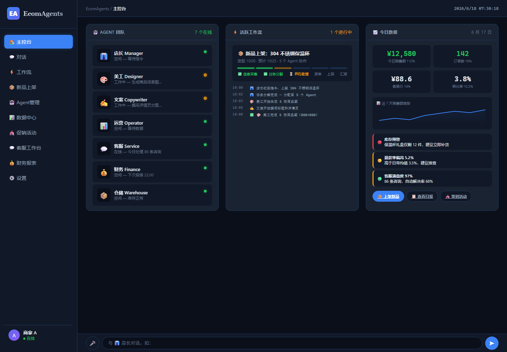
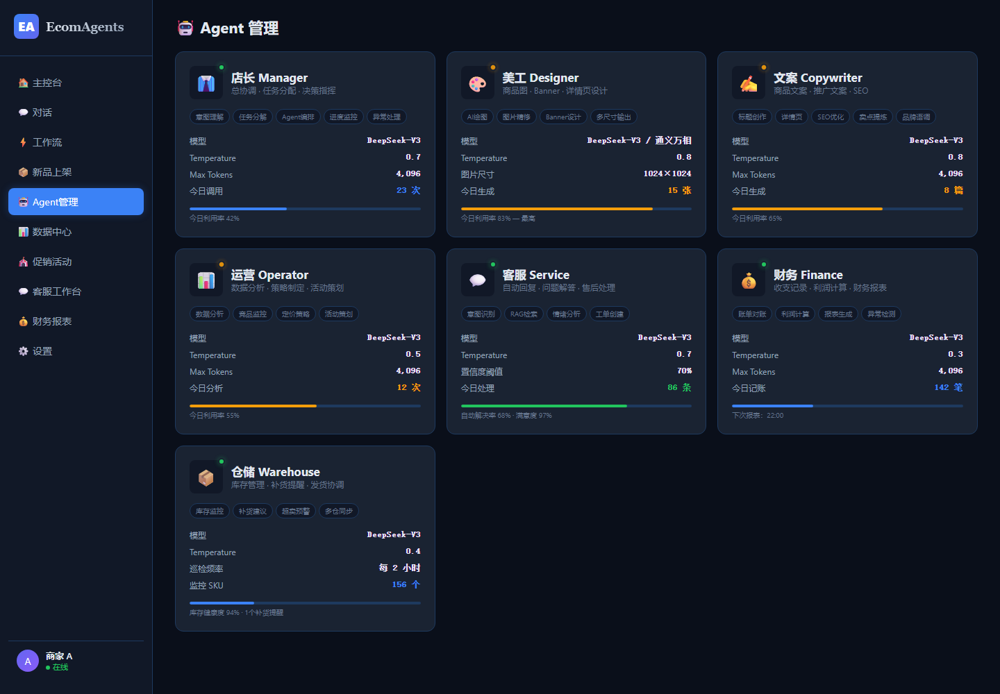
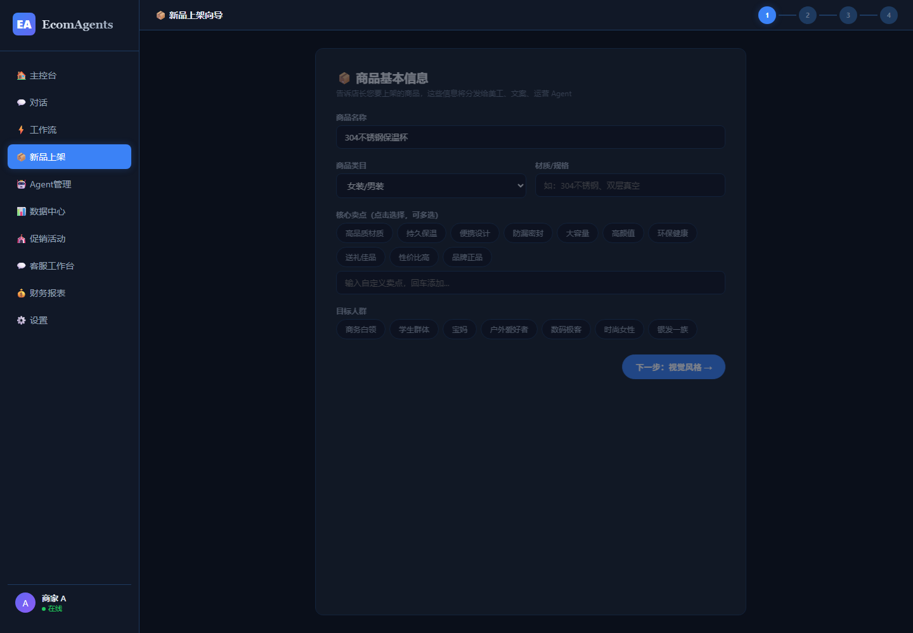
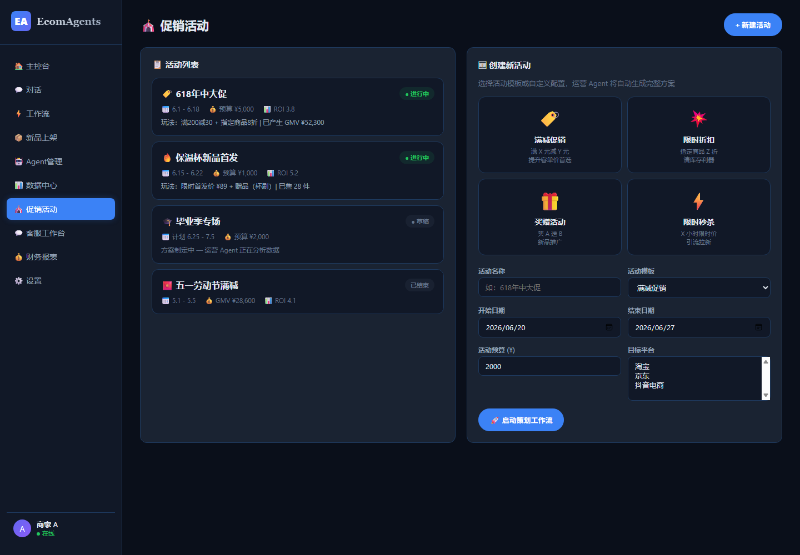
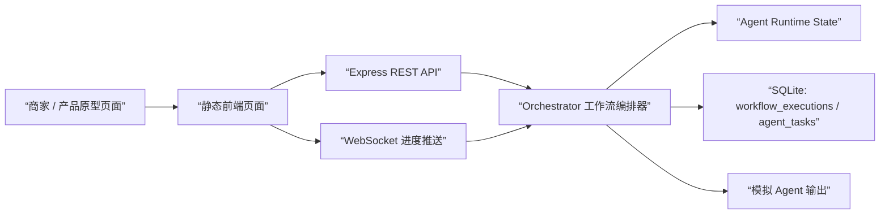

# 电商多 Agent 协同运营系统

一个面向中小电商商家的 **多 Agent 协同运营 Demo**。它把新品上架、促销策划、客服响应、库存巡检、财务报表等运营任务拆解给不同专业 Agent，并由 Orchestrator 统一编排。

> 当前项目是 AI 产品原型与架构验证 Demo，不是线上生产系统。Agent 输出和经营数据均为模拟数据，用于验证流程、交互和指标框架。

🔗 **在线 Demo**：[ecomagents.netlify.app](https://ecomagents.netlify.app)



## 为什么做这个项目

中小电商商家往往没有完整运营团队，但日常工作却横跨多个角色：

- 新品上架需要文案、美工、运营、仓储协作
- 促销活动需要预算、机制、素材、上线和复盘
- 客服、库存、财务、数据异常都要求及时响应

这个 Demo 尝试回答一个问题：

> 如果把电商运营拆成多个专业 Agent，并用中心编排器统一调度，能不能形成一个可追踪、可评估、可演示的 AI 运营工作台？

## Demo 展示

### 主控台

展示 Agent 团队状态、活跃工作流、今日经营数据和异常提醒。


### Agent 管理

展示 7 类专业 Agent 的角色、能力、运行状态和任务分工。



### 新品上架向导

通过结构化表单收集商品信息，并模拟触发美工、文案、运营、仓储等 Agent 协同。



### 促销活动

围绕活动目标、预算、商品、素材和上线配置，模拟促销策划工作流。



## 核心能力

已实现的 Demo 能力：

- **7 类 Agent 角色**：店长、美工、文案、运营、客服、财务、仓储
- **3 条工作流**：新品上架、促销活动、日常运营
- **可运行本地 Demo**：静态页面 + REST API + WebSocket
- **工作流编排**：支持串行步骤与并行 Agent 任务
- **人工审核节点（HITL）**：质量审核步骤支持人工通过 / 打回重做
- **状态展示**：Agent 在线、忙碌、任务进度可视化
- **数据看板**：基于 31 天模拟经营数据展示趋势和异常
- **任务记录**：SQLite 记录 workflow execution 和 agent task
- **基础测试**：Jest smoke tests 覆盖 Agent 与 workflow 定义

## Agent 团队

| Agent | 职责 | 示例任务 |
| --- | --- | --- |
| 店长 | 意图理解、任务拆解、进度监控、结果汇总 | 拆解新品上架流程，审核各 Agent 输出 |
| 美工 | 商品图、Banner、详情页视觉素材 | 生成主图、场景图、活动海报 |
| 文案 | 商品标题、详情页、SEO、活动文案 | 撰写标题、卖点、详情页文案 |
| 运营 | 数据分析、定价策略、促销方案 | 分析竞品价格，设计活动机制 |
| 客服 | 咨询回复、售后处理、人工升级 | 识别咨询意图，生成回复建议 |
| 财务 | 收支记录、利润计算、报表生成 | 计算利润，生成财务摘要 |
| 仓储 | 库存监控、补货建议、发货追踪 | 检查库存水位，提示补货风险 |

## 系统架构



关键文件：

| 模块 | 文件 |
| --- | --- |
| 项目说明 | `README.md` |
| AI 协作指南 | `AGENTS.md`, `CLAUDE.md` |
| 服务入口 | `src/backend/server.js` |
| 工作流编排 | `src/backend/services/orchestrator.js` |
| Agent 状态管理 | `src/backend/services/agent-manager.js` |
| 数据库 | `src/backend/db/database.js` |
| 工作流配置 | `config/workflows.yaml` |
| 前端页面 | `src/frontend/` |
| 测试 | `tests/orchestrator.test.js` |

## 快速开始

Windows PowerShell 如果执行 `npm` 被策略拦截，可以使用 `npm.cmd`。

```bash
npm.cmd install
npm.cmd run init-db
npm.cmd start
```

打开本地 Demo：

```text
http://localhost:3000/dashboard.html
```

或直接访问在线 Demo（无需本地运行，静态页面，API 功能不可用）：

```text
https://ecomagents.netlify.app
```

运行测试：

```bash
npm.cmd test
```

健康检查：

```text
GET http://localhost:3000/api/health
```

## 常用 API

```text
GET  /api/health
GET  /api/agents
GET  /api/workflows
GET  /api/dashboard
POST /api/chat
POST /api/workflows/new_product/start
```

## Demo 边界

为了避免误解，这里明确当前版本的边界：

- Agent 输出是 `setTimeout + 模板文本` 模拟结果
- 经营数据是 seed/mock 数据
- 当前没有接入真实 LLM API、RAG、MCP 工具或电商平台 API
- 当前指标用于验证口径和链路，不代表真实商家业务结果
- 项目更适合定位为”AI 产品原型 + 架构验证 Demo”

> 当前版本重点验证多 Agent 工作流编排、状态流转、页面交互、任务记录和指标框架。Agent 输出与经营数据均为模拟数据，不代表真实线上业务结果。下一步会接入真实 LLM API、RAG 知识库、MCP 工具调用和种子商家数据，验证人工流程与 Agent 流程的真实差异。

## 面向 AI 产品岗位的项目价值

这个项目不把重点放在”后端工程实现”，而是用于展示 AI 产品 0-1 的完整思考：

- 如何识别电商运营中的高频、多角色、长链路场景
- 如何把业务角色抽象成专业 Agent
- 如何设计中心编排机制而不是让 Agent 无序通信
- 如何定义输入输出规范、状态流转和人工确认节点
- 如何用 Demo 验证页面交互、流程闭环和指标口径

## 后续迭代

- 接入真实 LLM API，优先替换文案 Agent
- 为客服 Agent 增加 RAG 知识库和人工升级策略
- 接入 MCP/tool calling，模拟商品上架、库存查询、订单查询
- 增加高风险动作的人审节点，例如改价、退款、正式上架
- 使用 2-3 个种子商家做真实对照试点，采集人工流程与 Agent 流程差异

## Acknowledgements

This project was inspired by open-source ecommerce agent demos and rebuilt as an AI product prototype for learning, portfolio, and interview preparation purposes.

## License

MIT
